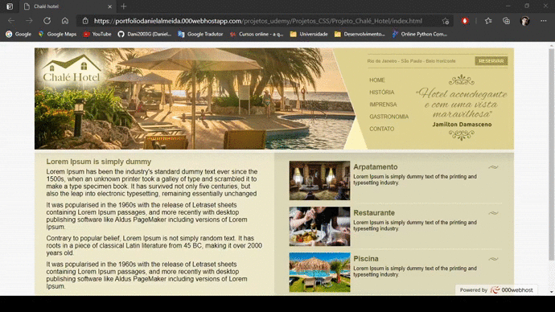

<h1 align="center">
     
    <br>
    <figcaption>Site em execução</figcaption>
</h1>

<h3 align="center">
    <a href="https://portfoliodanielalmeida.000webhostapp.com/projetos/projetos_css/projeto_chale_hotel/">Acessar demonstração</a>
</h3>

---

## 📋 Sobre 
O site chalé hotel foi criado no [Desenvolvimento Web Completo 2021](https://www.udemy.com/course/web-completo/) com o intuito de colocarmos em prática todo o conteúdo estudado na seção 5.

---

## 🚀 Tecnologias utilizadas

- [CSS3](https://www.w3schools.com/css/default.asp)

- [HTML5](https://www.w3schools.com/html/default.asp)

---

## 📁 Como baixar o projeto

```bash

    # Clonar o repositório
    $ git clone https://github.com/Dani2003G/Projeto_Chale_Hotel

    # Entrar no diretório
    $ cd Projeto_Chale_Hotel

    # Instalar as dependências
    $ yarn install

    # Iniciar o projeto
    $ yarn start

```
 